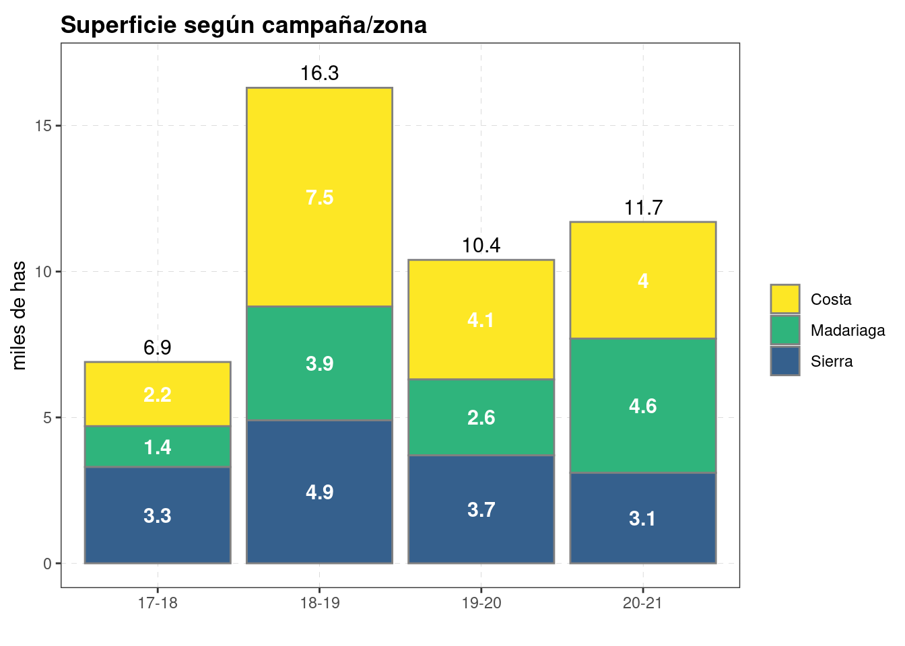
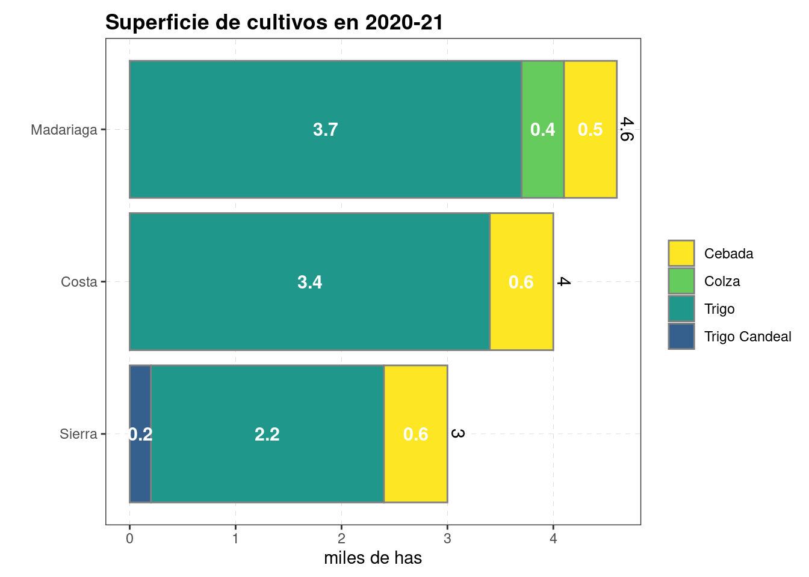

---
output:
  html_document:
    code_folding: hide
    chunk_output_type: console
---

# Superficies


```r
knitr::opts_chunk$set(echo = TRUE, message=FALSE, warning=FALSE)
pacman::p_load(tidyverse, googlesheets4, googledrive)
# drive_auth(email = "edwardsmolina@gmail.com")
# gs4_auth(email = "edwardsmolina@gmail.com")
source(here::here("0 themes.R"))
load(here::here("data/data.Rdata"))
# glimpse(dat)
```

## Superficie por zona / campaña


```r
(dat %>% 
   group_by(Zona, campana) %>% 
   summarise(super = round(sum(superficie, na.rm = TRUE)/1000,1)) %>% 
   ungroup() %>% 
   mutate(campana = factor(campana),
          # campana = forcats::fct_rev(campana),
          zona = factor(Zona)) %>% 
   ggplot(aes(
     x = campana,
     # x = reorder(Zona, super, sum),
     y = super, 
     fill = Zona)) + 
   geom_bar(stat = "identity", color = gray(.5)) +
   geom_text(aes(label = super), 
             position = position_stack(vjust = 0.5),
             col = "white", fontface = "bold", size = 4)+
   # coord_flip()+
   labs(x = "", y = "miles de has", fill = "", 
        title =  "Superficie según campaña/zona")+
   geom_text(
     aes(
       # x = reorder(Zona, super, sum),
       x = campana,
       label = stat(y), 
       group = campana),
     stat = 'summary', fun = sum, angle = 0,
     vjust = -0.5, hjust=0.5, size = 4)+ 
   scale_fill_viridis_d(begin = 0.3, end =1, direction = -1)+
   lims(y=c(0,17))+
   theme_bw2
)
```




```r
ggsave(last_plot(), file = "plots/sup_campana_zona.png", width = 7, height = 4)
drive_upload(path = as_dribble("juanchi_guille/JMF_fina_2020"), "plots/sup_campana_zona.png", overwrite = TRUE)
```

## Superficie de cultivos / zona


```r
(dat %>% 
  filter(campana == "20-21") %>% 
 group_by(Zona, cultivo_de_cosecha) %>% 
  summarise(super = round(sum(superficie)/1000,1)) %>% 
  ungroup() %>% 
  mutate(Zona = factor(Zona),
         # campana = forcats::fct_rev(campana),
         cultivo_de_cosecha = factor(cultivo_de_cosecha)) %>%
   filter(between(super, 0.1, 10000)) %>% 

  ggplot(aes(
    x =reorder(Zona, super, sum),
    y = super, fill = cultivo_de_cosecha)) + 
  geom_bar(stat = "identity", color = gray(.5)) +
  geom_text(aes(label = super), 
            position = position_stack(vjust = 0.5),
            col = "white", fontface = "bold", size = 4)+
  coord_flip()+
  labs(x = "", y = "miles de has", fill = "", 
       title =  "Superficie de cultivos en 2020-21")+
  geom_text(
    aes(x = reorder(Zona, super, sum),
        label = stat(y), group = Zona),
    stat = 'summary', fun = sum, angle = 270,
    vjust = -0.3, hjust=0.5, size = 4)+ 
  scale_fill_viridis_d(begin = 0.3, end =1, direction = -1)+
  theme_bw2
)
```




```r
ggsave(last_plot(), file = "plots/sup_cultivos.png", width = 7, height = 4)
drive_upload(path = as_dribble("juanchi_guille/JMF_fina_2020"), "plots/sup_cultivos.png", overwrite = TRUE)
```
