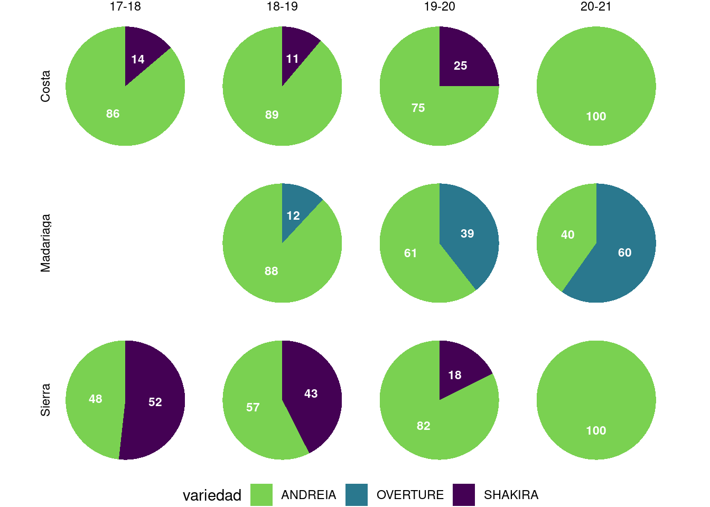
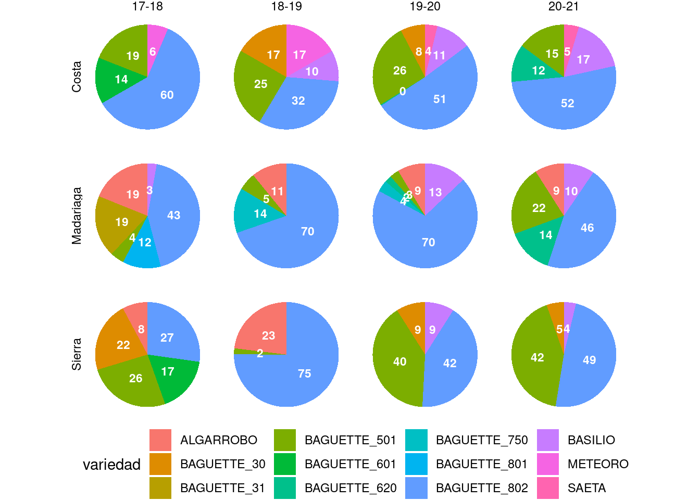
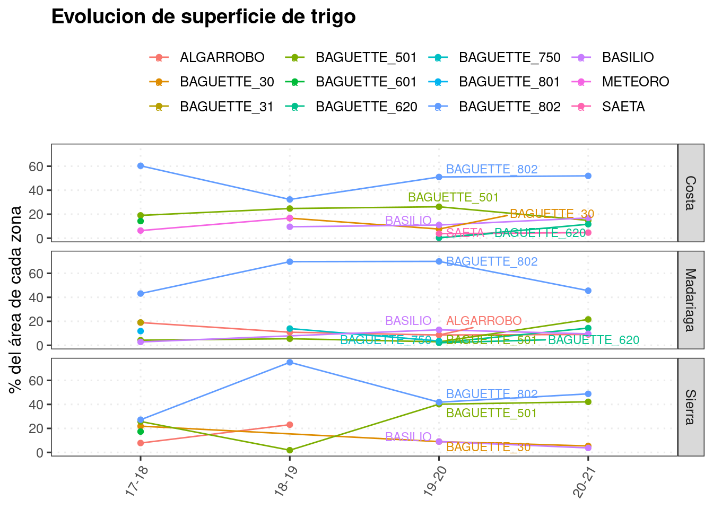
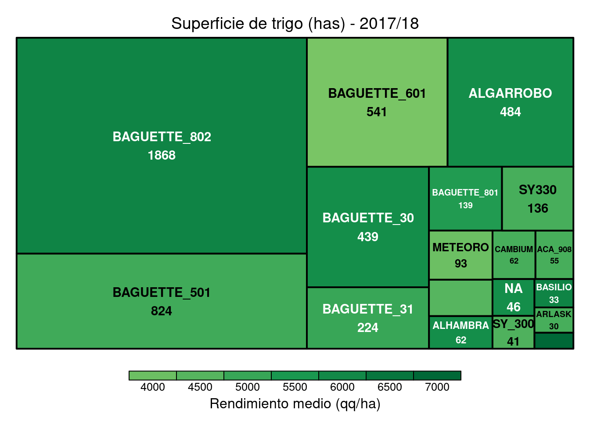
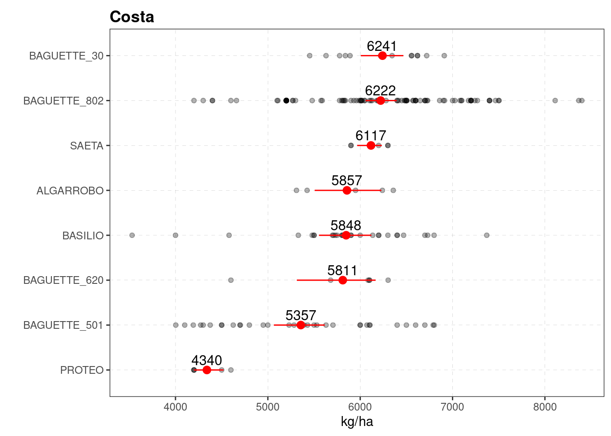
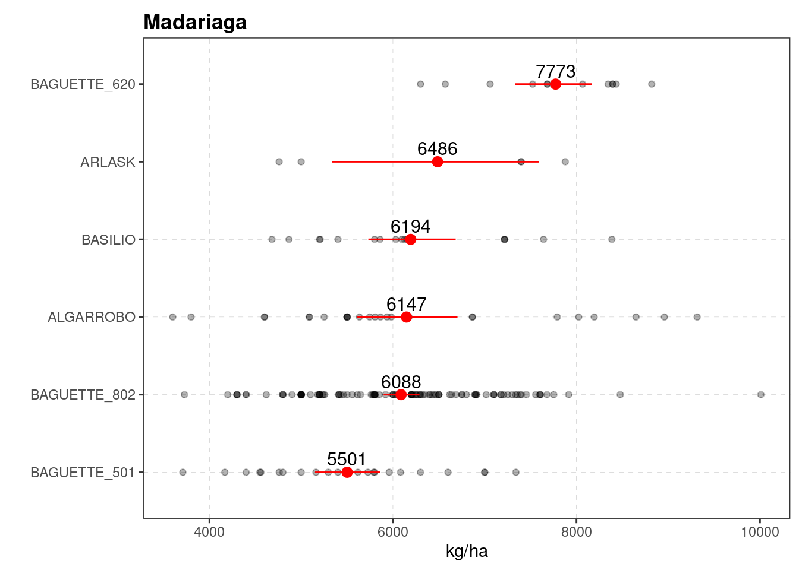
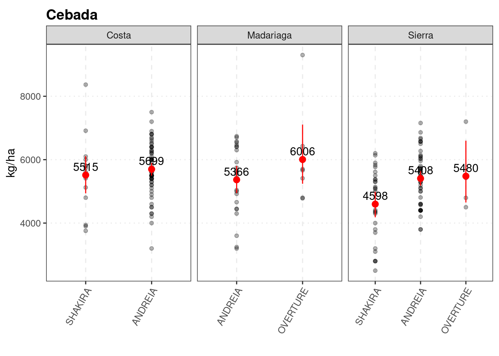

# Variedades


```r
knitr::opts_chunk$set(echo = TRUE, message=FALSE, warning=FALSE)
pacman::p_load(tidyverse)
# pacman::p_load(tidyverse, googlesheets4, googledrive)
# javi <- gs4_get("1jTFU8fQw2fiTyfrhuPSjc4lcAC6U9G-zjvOlADQ6JNE")
# gs4_browse(javi)
# drive_auth(email = "edwardsmolina@gmail.com")
# gs4_auth(email = "edwardsmolina@gmail.com")
source(here::here("0 themes.R"))
load(here::here("data/data.Rdata"))
# glimpse(dat)
```


```r
dat %>%
  filter(str_detect(cultivo_de_cosecha, 'Tr|Ceb')) %>%
  select(cultivo_de_cosecha, campana,Zona, variedad, rinde, superficie ) %>% 
  group_by(cultivo_de_cosecha, Zona, variedad) %>%
  filter(n() > 5) %>% ungroup %>% 
  mutate_if(is.character, as.factor) %>% 
  group_by(cultivo_de_cosecha, Zona, campana, variedad) %>%
  summarise(#var_lotes= n(), 
    var_sup = sum(superficie, na.rm = TRUE),
    rinde_medio = median(rinde, na.rm = TRUE), 
    .groups = 'drop') %>% 
  group_by(cultivo_de_cosecha, Zona, campana) %>% 
  mutate(porcent=var_sup/sum(var_sup)*100) -> dat_var
dat_var
```

```
## # A tibble: 82 x 7
## # Groups:   cultivo_de_cosecha, Zona, campana [26]
##    cultivo_de_cosecha Zona      campana variedad var_sup rinde_medio porcent
##    <fct>              <fct>     <fct>   <fct>      <dbl>       <dbl>   <dbl>
##  1 Cebada             Costa     17-18   ANDREIA     500        5400     86.2
##  2 Cebada             Costa     17-18   SHAKIRA      80        6100     13.8
##  3 Cebada             Costa     18-19   ANDREIA    2014        5500     88.8
##  4 Cebada             Costa     18-19   SHAKIRA     253        3920.    11.2
##  5 Cebada             Costa     19-20   ANDREIA     860        5700     75.0
##  6 Cebada             Costa     19-20   SHAKIRA     287        5536     25.0
##  7 Cebada             Costa     20-21   ANDREIA     319        6225    100  
##  8 Cebada             Madariaga 18-19   ANDREIA     488.       4790.    88.1
##  9 Cebada             Madariaga 18-19   OVERTURE     66        5665     11.9
## 10 Cebada             Madariaga 19-20   ANDREIA     118.       6024     60.6
## # … with 72 more rows
```


```r
dat_var %>% #data.frame
  filter(cultivo_de_cosecha =="Cebada") %>% 
  ggplot(aes(x =factor(1), y = porcent, fill = variedad)) +
  geom_bar(stat='identity') +
  coord_polar(theta = "y")+
  facet_grid(Zona ~ campana, switch = "y")+
  theme_void()+
  geom_text(aes(label=paste0(round(porcent))), 
            position=position_stack(vjust=0.5), color="white",size=3, fontface ="bold")+
  theme(legend.position="bottom")+
  scale_fill_viridis_d(begin = 0, end =0.8, direction = -1)
```



```r
# ggsave(last_plot(), file = "plots/sup_var_zona_ceb.png", width = 7, height = 4)
# drive_upload(path = as_dribble("juanchi_guille/JMF_fina_2020"), "plots/sup_var_zona_ceb.png", overwrite = TRUE)
```


```r
dat_var %>% #data.frame
  filter(cultivo_de_cosecha =="Trigo") %>% 
  ggplot(aes(x =factor(1), y = porcent, fill = variedad)) +
  geom_bar(stat='identity') +
  coord_polar(theta = "y")+
  facet_grid(Zona ~ campana, switch = "y")+
  theme_void()+
  geom_text(aes(label=paste0(round(porcent))), 
            position=position_stack(vjust=0.5), color="white",size=3, fontface ="bold")+
  theme(legend.position="bottom")+
  scale_fill_hue()
```



```r
# ggsave(last_plot(), file = "plots/sup_var_zona_tr1.png", width = 7, height = 4)
```


```r
dat_var %>% 
  filter(cultivo_de_cosecha == "Trigo") %>%
    # filter(variedad == "Andreia") 
  # drop_na(rinde) %>%
  ggplot(aes(x = factor(campana), 
             y = porcent, 
             col = variedad, 
             group =variedad))+
  geom_line()+geom_point()+
  facet_grid(Zona~.)+
  labs(x = NULL, y = "% del área de cada zona",  col="",
       title = "Evolucion de superficie de trigo")+
  # guides(col="none")+
  ggrepel::geom_text_repel(
    data = dat_var %>% 
        filter(cultivo_de_cosecha == "Trigo") %>%
      filter(campana == "19-20"),
      # drop_na(tecno_sts),
    aes(label = variedad), size =3, nudge_x = 0.1) +
  theme_dens1
```



```r
# ggsave(last_plot(), file = "plots/evolucion_trigo.png", w =7, h=4)
```

## Superficies (tamaño de cuadrados) y rendimientos (intensidad de color) 


```r
library(treemap)
```


```r
dat_sum <- dat %>% 
  # filter(cultivo_de_cosecha == "Trigo") %>% 
  # filter(campana == "19-20") %>% 
  # group_by(variedad) %>%
  # filter(n()>10) %>% ungroup %>%
  group_by(campana, cultivo_de_cosecha, variedad) %>%
  summarise(lotes= n(), 
            sup = sum(superficie, na.rm = TRUE),
            rinde_medio = median(rinde, na.rm = TRUE), .groups = 'drop') %>% 
  mutate_if(is.character, as.factor)%>%
  mutate(label = paste(variedad, round(sup,0), sep = "\n")) 
```


```r
# png(filename="plots/treemap_trigo_17-18.png", 
#     width = 120, height = 120, units='mm', res = 300)

subset(dat_sum, 
       cultivo_de_cosecha == "Trigo" & 
       campana == '17-18') %>% 
  treemap(index="label",
          vSize="sup",
          vColor="rinde_medio",
          # border.col=c("grey70", "grey90"),
          # palette="Spectral",
          type = "value",
          title = "Superficie de trigo (has) - 2017/18",
          title.legend = "Rendimiento medio (qq/ha)",
          overlap.labels=1, 
          bg.labels=c("transparent"),              
          inflate.labels=F,
          align.labels=c("center", "center")) 
```



```r
# dev.off()

# drive_upload(path = as_dribble("juanchi_guille/JMF_fina_2020"), "plots/treemap_trigo_17-18.png", overwrite = TRUE)
```


```r
evol_trigo <- list.files(path = here::here("plots"), 
                         pattern = "treemap_", 
                         all.files = TRUE, full.names = TRUE)
evol_trigo %>% 
  map(~ drive_upload(.,
                     path = as_dribble("juanchi_guille/JMF_fina_2020"),
                     overwrite = TRUE)
  )
```


```r
# png(filename="plots/treemap_cebada.png", 
#     width = 120, height = 120, units='mm', res = 300)

subset(dat_sum, 
       cultivo_de_cosecha == "Cebada" ) %>% 
  treemap(index=c("campana", "label"),
          vSize="sup",
          vColor="rinde_medio",
          # border.col=c("grey70", "grey90"),
          # palette="Spectral",
          type = "value",
          title = "Superficie de cebada (has)",
          title.legend = "Rendimiento medio (qq/ha)",
          overlap.labels=1, 
          bg.labels=c("transparent"),              # Background color of labels
          inflate.labels=F,
           align.labels=list(
        c("left", "top"),
        c("center", "center"))) 
```


```r
# dev.off()
# 
# drive_upload(path = as_dribble("juanchi_guille/JMF_fina_2020"), "plots/treemap_cebada.png", overwrite = TRUE)
```

## Performance variedades


```r
dat %>%
  filter(str_detect(cultivo_de_cosecha, 'Tr|Ceb')) %>%
  select(campana,Zona, cultivo_de_cosecha, variedad,rinde ) %>% 
  group_by(cultivo_de_cosecha, Zona, variedad) %>%
  filter(n() > 3) %>% ungroup %>% 
  mutate_if(is.character, as.factor) ->dat1

dat1 %>% 
  filter(str_detect(cultivo_de_cosecha, 'Tr')) %>%
  filter(campana == "20-21") %>% 
  distinct(variedad) %>% 
  pull() %>% 
  droplevels()-> var_20_tr
```


```r
trigo_zona = levels(dat1$Zona) %>% 
  map(~ subset(dat1, cultivo_de_cosecha== "Trigo" &
                 variedad %in% var_20_tr &
                 Zona == . ) %>%   
        ggplot()+
        aes(x=reorder(variedad, rinde, mean), y=rinde)+
        geom_point(alpha=0.3)+
        stat_summary(fun.data = "mean_cl_boot", colour = "red", size = 0.5)+
        coord_flip()+
        theme_bw2+
        stat_summary(aes(label=round(..y..,0)), 
                     fun=mean, geom="text", size=4,vjust = -0.5)+
        scale_y_continuous(breaks= scales::pretty_breaks())+
        labs(title = paste0(.), 
             x="", y="kg/ha")
  ) 
trigo_zona
```

```
## [[1]]
```



```
## 
## [[2]]
```



```
## 
## [[3]]
```


```r
# trigo_zona[[1]] %>% 
#   ggsave(file = "plots/trigo_perf_Costa.png", w=5, h=5)
# trigo_zona[[2]] %>% 
#   ggsave(file = "plots/trigo_perf_Madariaga.png", w=5, h=5)
# trigo_zona[[3]] %>% 
#   ggsave(file = "plots/trigo_perf_Sierra.png", w=5, h=5)
```


```r
list.files(path = here::here("plots"), 
           pattern = "perf", 
           all.files = TRUE, full.names = TRUE) %>%   
  map(~ drive_upload(., path = as_dribble("juanchi_guille/JMF_fina_2020/plots"), 
overwrite = TRUE))
```


```r
dat1 %>% 
  filter(str_detect(cultivo_de_cosecha, 'Ceb')) %>%
  ggplot()+
  aes(x=reorder(variedad, rinde, mean), y=rinde)+
  facet_wrap(Zona~., scales="free_x")+
  
  geom_point(alpha=0.3)+
  stat_summary(fun.data = "mean_cl_boot", colour = "red", size = 0.5)+
  # coord_flip()+
  theme_aapre+
  stat_summary(aes(label=round(..y..,0)), 
               fun=mean, geom="text", size=4,vjust = -0.5)+
  scale_y_continuous(breaks= scales::pretty_breaks())+
  labs(title = "Cebada", 
       x="", y="kg/ha")
```




```r
last_plot() %>%  
  ggsave(file = "plots/cebada_perf.png", w=5, h=4)
drive_upload(path = as_dribble("juanchi_guille/JMF_fina_2020/plots"), "plots/cebada_perf.png", overwrite = TRUE)
```

