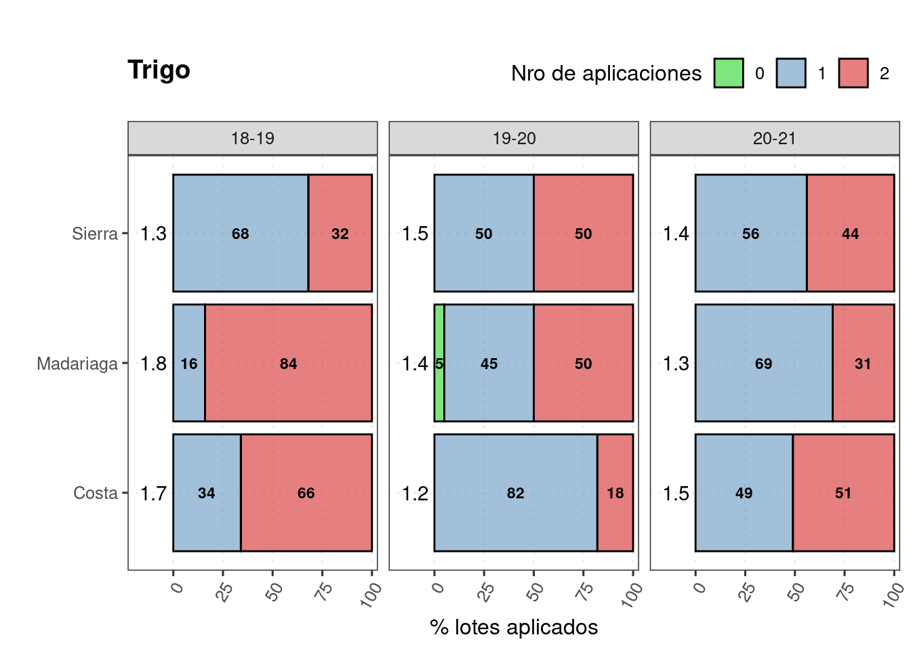
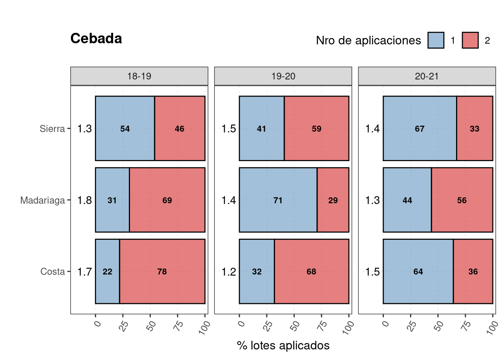
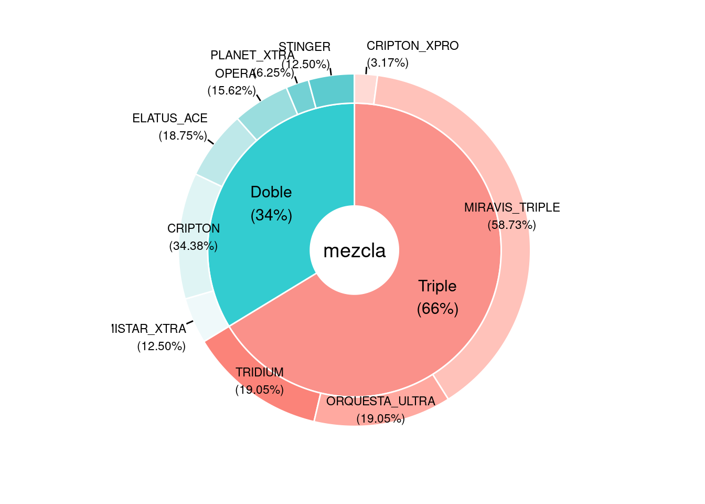
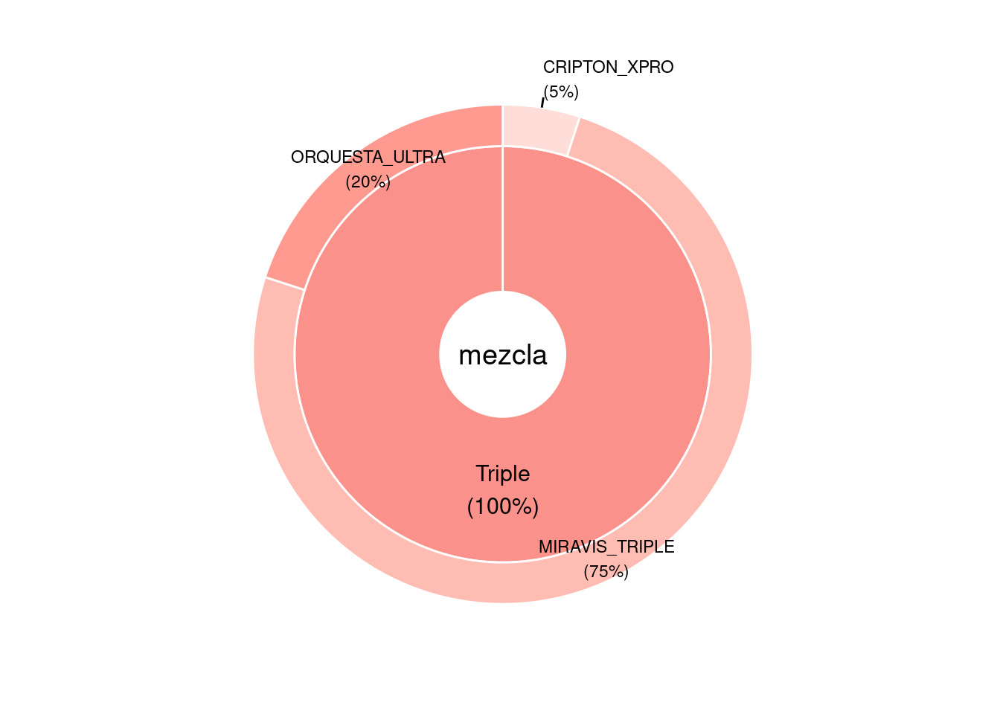
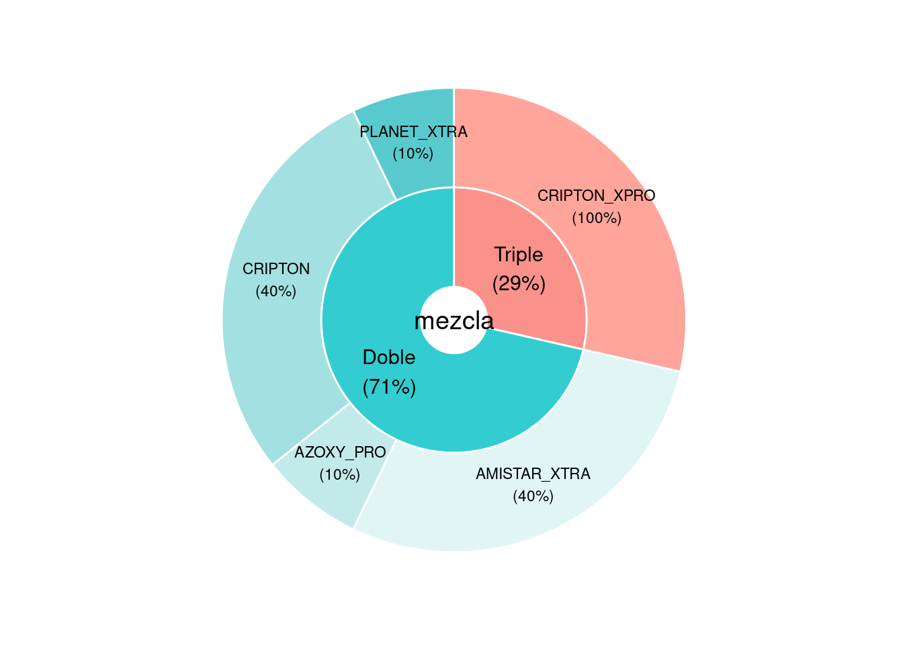
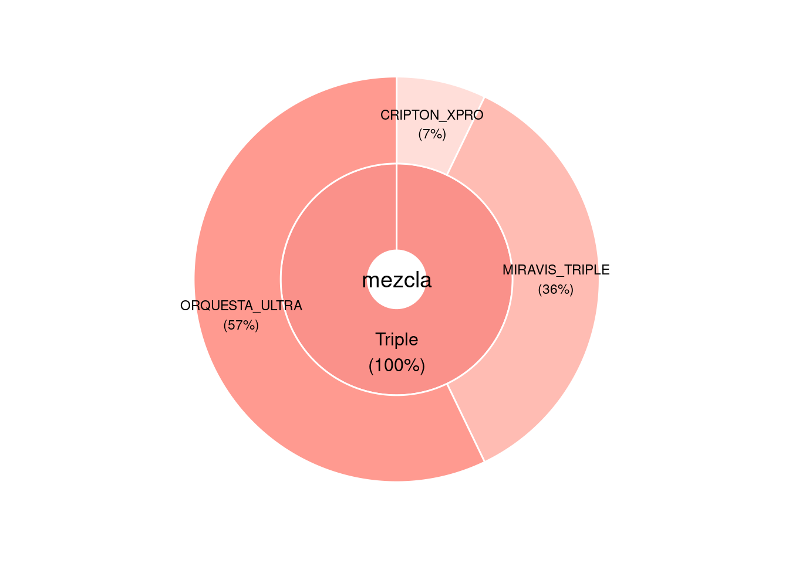
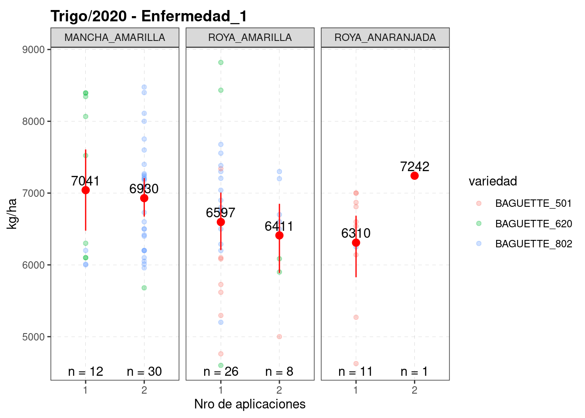

# Protección


```r
knitr::opts_chunk$set(echo = TRUE, message=FALSE, warning=FALSE)
pacman::p_load(tidyverse, googlesheets4, googledrive)
# drive_auth(email = "edwardsmolina@gmail.com")
# gs4_auth(email = "edwardsmolina@gmail.com")
source(here::here("0 themes.R"))
load(here::here("data/data.Rdata"))
# glimpse(dat)
```


```r
fungicidas = "https://docs.google.com/spreadsheets/d/1cTzo36jHRULfBf8c83TDpauxiwHrxeKrGprUUxLRzm0/edit?usp=sharing"
fungic <- gs4_get(fungicidas)
dfungi <- read_sheet(fungic, sheet = "fungi") 
dfungi <- dfungi %>% 
  distinct(producto, .keep_all = TRUE)  %>% 
  arrange(producto)
head(dfungi)
```

```
## # A tibble: 6 x 18
##   Cultivo Empresa  producto dosis activos grupos DMI_1 DMI_2 QoI_1 SDHI_1 SDHI_2
##   <chr>   <chr>    <chr>    <dbl>   <dbl> <chr>  <chr> <chr> <chr> <chr>  <chr> 
## 1 Cebada  BASF     ALLEGRO   0.75       2 TE     Epox… <NA>  kres… <NA>   <NA>  
## 2 Cebada  Adama    ALMAGOR   1.25       3 TTE    Tebu… Proc… Azox… <NA>   <NA>  
## 3 Cebada  Syngenta AMISTAR…  0.4        2 TE     Cypr… <NA>  Azox… <NA>   <NA>  
## 4 Trigo   Genérico AZOXY_P…  0.4        2 TE     Cypr… <NA>  Azox… <NA>   <NA>  
## 5 Cebada  Zamba    CINCHA_…  0.4        2 TE     Cypr… <NA>  Azox… <NA>   <NA>  
## 6 Cebada  Bayer    CRIPTON   0.6        2 TE     Prot… <NA>  Trif… <NA>   <NA>  
## # … with 7 more variables: contacto <chr>, c.DMI1 <dbl>, c.DMI2 <dbl>,
## #   c.QoI <dbl>, c.SDHI1 <dbl>, c.SDHI2 <dbl>, c.contacto <dbl>
```


```r
dat %>%   
  select(cultivo_de_cosecha, campana, Zona, contains("fungicida")) %>% 
  filter(str_detect(cultivo_de_cosecha, 'Tr|Ceb')) %>%
  filter(!str_detect(cultivo_de_cosecha, 'Candeal')) %>%
  rowwise() %>% 
  mutate(aplicaciones = sum(!is.na(fungicida1), !is.na(fungicida2))) %>% 
  ungroup() %>% 
  count(cultivo_de_cosecha, Zona, campana, aplicaciones) %>% 
  arrange(cultivo_de_cosecha, Zona,campana, aplicaciones, -n) %>% 
  group_by(cultivo_de_cosecha, Zona, campana) %>%
  mutate(porcent = round((n/sum(n))*100)) -> dat_fungi
head(dat_fungi)
```

```
## # A tibble: 6 x 6
## # Groups:   cultivo_de_cosecha, Zona, campana [4]
##   cultivo_de_cosecha Zona  campana aplicaciones     n porcent
##   <chr>              <chr> <chr>          <int> <int>   <dbl>
## 1 Cebada             Costa 17-18              0    15     100
## 2 Cebada             Costa 18-19              1     9      22
## 3 Cebada             Costa 18-19              2    31      78
## 4 Cebada             Costa 19-20              1     6      32
## 5 Cebada             Costa 19-20              2    13      68
## 6 Cebada             Costa 20-21              1     7      64
```

Cuantas aplicaciones se llevan los cultivos?


```r
dat_fungi %>%
  filter(!campana == "17-18") %>% 
  group_by(cultivo_de_cosecha, Zona, campana)%>%
  summarise(media = weighted.mean(aplicaciones, n)) -> n_fungi
head(n_fungi)
```

```
## # A tibble: 6 x 4
## # Groups:   cultivo_de_cosecha, Zona [2]
##   cultivo_de_cosecha Zona      campana media
##   <chr>              <chr>     <chr>   <dbl>
## 1 Cebada             Costa     18-19    1.78
## 2 Cebada             Costa     19-20    1.68
## 3 Cebada             Costa     20-21    1.36
## 4 Cebada             Madariaga 18-19    1.69
## 5 Cebada             Madariaga 19-20    1.29
## 6 Cebada             Madariaga 20-21    1.56
```


```r
dat_fungi %>% 
  mutate(aplicaciones = fct_relevel(as.factor(aplicaciones), c('0','1','2'))) %>% 
  filter(!campana =="17-18") %>% 
  filter(cultivo_de_cosecha =="Trigo") %>% 
  ggplot(aes(x = Zona, y = porcent,  fill =forcats::fct_rev(aplicaciones), 
             label = round(porcent))) +
  facet_grid(. ~ campana)+
  geom_col(position = position_stack(), color = "black", alpha= 0.5) +
  geom_text(position = position_stack(vjust = .5), fontface = "bold", size=3) +
  labs(title = "Trigo" ,
       fill = "Nro de aplicaciones", 
       x = "", y = "% lotes aplicados")+
  geom_text(data = n_fungi %>% 
                filter(cultivo_de_cosecha =="Trigo"), 
            aes(x= Zona, y=-10, 
                label = round(media,1), 
                fill = NA), 
            angle = 0) +
  scale_y_continuous(expand = expand_scale(add = c(13,3)))+
  theme(axis.text.x=element_blank())+
  coord_flip()+
  scale_fill_manual(values = c("0"= "green3", "1"="steelblue", "2" ="red3"))+
  theme_dens1_legend
```



```r
# ggsave(last_plot(), file = "5_plots_fungi/fungicidas_aplicaciones_trigo.png", width = 7, height = 3)
```


```r
dat_fungi %>% 
  mutate(aplicaciones = fct_relevel(as.factor(aplicaciones), c('0','1','2'))) %>% 
  filter(!campana =="17-18") %>% 
  filter(cultivo_de_cosecha =="Cebada") %>% 
  ggplot(aes(x = Zona, y = porcent,  fill =forcats::fct_rev(aplicaciones), 
             label = round(porcent))) +
  facet_grid(. ~ campana)+
  geom_col(position = position_stack(), color = "black", alpha= 0.5) +
  geom_text(position = position_stack(vjust = .5), fontface = "bold", size=3) +
  labs(title = "Cebada" ,
       fill = "Nro de aplicaciones", 
       x = "", y = "% lotes aplicados")+
  geom_text(data = n_fungi %>% 
                filter(cultivo_de_cosecha =="Trigo"), 
            aes(x= Zona, y=-10, 
                label = round(media,1), 
                fill = NA), 
            angle = 0) +
  scale_y_continuous(expand = expand_scale(add = c(13,3)))+
  theme(axis.text.x=element_blank())+
  coord_flip()+
  scale_fill_manual(values = c("0"= "green3", "1"="steelblue", "2" ="red3"))+
  theme_dens1_legend  
```



```r
# ggsave(last_plot(), file = "5_plots_fungi/fungicidas_aplicaciones_cebada.png", width = 7, 
#        height = 3)
```

Lotes aplicados en 2020


```r
dat %>% 
  filter(campana == "20-21") %>% 
  filter(fungicida == "Si") %>% 
  filter(str_detect(cultivo_de_cosecha, 'Tr|Ceb')) %>%
  filter(!str_detect(cultivo_de_cosecha, 'Candeal')) %>%
  select(cultivo_de_cosecha, Zona, campo, variedad, fungicida:enfermedad_2, rinde) %>% 
  rowwise() %>%
  mutate(aplicaciones = sum(!is.na(fungicida1),!is.na(fungicida2), na.rm = T)) -> df20

head(df20)
```

```
## # A tibble: 6 x 13
## # Rowwise: 
##   cultivo_de_cosecha Zona  campo    variedad    fungicida fungicida1 feno_fungi1
##   <chr>              <chr> <chr>    <chr>       <chr>     <chr>      <list>     
## 1 Trigo              Costa La Susa… BAGUETTE_8… Si        ELATUS_ACE <chr [1]>  
## 2 Trigo              Costa La Susa… BAGUETTE_8… Si        ELATUS_ACE <chr [1]>  
## 3 Trigo              Costa La Susa… BAGUETTE_8… Si        ELATUS_ACE <chr [1]>  
## 4 Trigo              Costa La Susa… BAGUETTE_8… Si        ELATUS_ACE <chr [1]>  
## 5 Trigo              Costa La Susa… BAGUETTE_8… Si        ELATUS_ACE <chr [1]>  
## 6 Trigo              Costa La Susa… BAGUETTE_8… Si        ELATUS_ACE <chr [1]>  
## # … with 6 more variables: enfermedad_1 <chr>, fungicida2 <chr>,
## #   feno_fungi2 <chr>, enfermedad_2 <chr>, rinde <dbl>, aplicaciones <int>
```

Los que aplican 1 solo fungi: en que estadio lo hacen?


```r
require(webr)
dfungi %>% 
  mutate(across(contains(".c"), ~.*dosis))
```

```
## # A tibble: 35 x 18
##    Cultivo Empresa producto dosis activos grupos DMI_1 DMI_2 QoI_1 SDHI_1 SDHI_2
##    <chr>   <chr>   <chr>    <dbl>   <dbl> <chr>  <chr> <chr> <chr> <chr>  <chr> 
##  1 Cebada  BASF    ALLEGRO   0.75       2 TE     Epox… <NA>  kres… <NA>   <NA>  
##  2 Cebada  Adama   ALMAGOR   1.25       3 TTE    Tebu… Proc… Azox… <NA>   <NA>  
##  3 Cebada  Syngen… AMISTAR…  0.4        2 TE     Cypr… <NA>  Azox… <NA>   <NA>  
##  4 Trigo   Genéri… AZOXY_P…  0.4        2 TE     Cypr… <NA>  Azox… <NA>   <NA>  
##  5 Cebada  Zamba   CINCHA_…  0.4        2 TE     Cypr… <NA>  Azox… <NA>   <NA>  
##  6 Cebada  Bayer   CRIPTON   0.6        2 TE     Prot… <NA>  Trif… <NA>   <NA>  
##  7 Cebada  Bayer   CRIPTON…  0.6        3 TEC    Prot… <NA>  Trif… Bixaf… <NA>  
##  8 Trigo   Adama   CUSTODIA  0.7        2 TE     Tebu… <NA>  Azox… <NA>   <NA>  
##  9 Trigo   Syngen… DACONIL   2          1 O      <NA>  <NA>  <NA>  <NA>   <NA>  
## 10 Cebada  BASF    DUETT_P…  1.2        2 TT     Epox… Metc… <NA>  <NA>   <NA>  
## # … with 25 more rows, and 7 more variables: contacto <chr>, c.DMI1 <dbl>,
## #   c.DMI2 <dbl>, c.QoI <dbl>, c.SDHI1 <dbl>, c.SDHI2 <dbl>, c.contacto <dbl>
```

```r
df20 %>% 
  count(cultivo_de_cosecha, aplicaciones, producto= fungicida1) %>% 
  arrange(-n) %>% 
  left_join(select(dfungi, producto, activos, grupos),  by = "producto") %>%
  drop_na(producto) %>%
  mutate(mezcla = case_when(
    activos == 2 ~ "Doble", 
    activos == 3 ~ "Triple"), 
    mezcla = fct_rev(mezcla)) -> df20_fungi1
head(df20_fungi1)
```

```
## # A tibble: 6 x 7
##   cultivo_de_cosecha aplicaciones producto           n activos grupos mezcla
##   <chr>                     <int> <chr>          <int>   <dbl> <chr>  <fct> 
## 1 Trigo                         1 MIRAVIS_TRIPLE    37       3 TCC    Triple
## 2 Trigo                         2 CRIPTON           22       2 TE     Doble 
## 3 Cebada                        1 MIRAVIS_TRIPLE    15       3 TCC    Triple
## 4 Trigo                         2 AMISTAR_XTRA      15       2 TE     Doble 
## 5 Trigo                         1 ORQUESTA_ULTRA    12       3 TEC    Triple
## 6 Trigo                         1 TRIDIUM           12       3 TEO    Triple
```


```r
df20_fungi1 %>% 
  filter(cultivo_de_cosecha == "Trigo") %>% 
  filter(aplicaciones ==1) %>%
  PieDonut(aes(pies=mezcla, donuts=producto, count =n))
```



```r
# ggsave(file = "plots_fungi/aplic_simple_tr.png", width = 6, height = 6)
```


```r
df20_fungi1 %>% 
  filter(cultivo_de_cosecha == "Cebada") %>% 
  filter(aplicaciones ==1) %>%
  PieDonut(aes(pies=mezcla, donuts=producto, count =n))
```



```r
# ggsave(file = "5_plots_fungi/aplic_simple_ceb.png", width = 6, height = 6)
```


```r
df20_fungi1 %>% 
  filter(aplicaciones ==2) %>% 
  filter(cultivo_de_cosecha == "Trigo") %>% 
  PieDonut(aes(pies=mezcla, donuts=producto, count =n), 
           labelposition=1, r0=0.2,r1=0.8,r2=1.4)
```


```r
# ggsave(file = "5_plots_fungi/aplic_simple_ceb.png", width = 6, height = 6)
```


```r
df20_fungi1 %>% 
  filter(aplicaciones ==2) %>%
  filter(cultivo_de_cosecha == "Cebada") %>% 
  PieDonut(aes(pies=mezcla, donuts=producto, count =n), 
  labelposition=0, r0=0.2,r1=0.8,r2=1.4)
```




```r
df20 %>% 
  filter(aplicaciones ==2) %>% 
  count(cultivo_de_cosecha, producto= fungicida2) %>% 
  arrange(-n) %>% 
  left_join(select(dfungi, producto, activos, grupos),  by = "producto") %>%
  drop_na(producto) %>%
  mutate(mezcla = case_when(
    activos == 2 ~ "Doble", 
    activos == 3 ~ "Triple"), 
    mezcla = fct_rev(mezcla)) -> df20_fungi2

df20_fungi2 %>% 
  filter(cultivo_de_cosecha == "Trigo") %>%
  PieDonut(aes(pies=mezcla, donuts=producto, count =n), 
           labelposition=0, r0=0.2,r1=0.8,r2=1.4) 
```


```r
df20_fungi2 %>% 
  filter(cultivo_de_cosecha == "Cebada") %>% 
  PieDonut(aes(pies=mezcla, donuts=producto, count =n), 
  labelposition=0, r0=0.2,r1=0.8,r2=1.4) 
```




```r
list.files(path = here::here("fungi_plots"), 
           pattern = ".png", 
           all.files = TRUE, full.names = TRUE) %>%   
  map(~ drive_upload(., path = as_dribble("juanchi_guille/JMF_fina_2020/5_plots_fungi"), 
overwrite = TRUE))
```

```
## list()
```


```r
df20  %>% 
  filter(cultivo_de_cosecha == "Trigo") %>%
  # filter(aplicaciones == 1) %>% 
     drop_na(enfermedad_1) %>%
  rename(producto = fungicida1) %>% 
  left_join(select(dfungi, producto, activos, grupos),  by = "producto") %>%
  drop_na(producto) %>%
  mutate(mezcla = case_when(
    activos == 2 ~ "Doble", 
    activos == 3 ~ "Triple"), 
    mezcla = mezcla) %>% 
  ggplot()+
  facet_grid(enfermedad_1 ~ Zona, scales = "free_y")+
  aes(x = factor(aplicaciones), y=rinde)+
  geom_point(alpha=0.3)+
  stat_summary(fun.data = "mean_cl_boot", colour = "red", size = 0.5)+
  stat_summary(aes(label=round(..y..,0)), 
               fun=mean, geom="text", size=4,vjust = -0.5)+
  labs(x = "Nro de aplicaciones", y = "kg/ha", title = "Trigo/2020")+
  theme_bw2
```


```r
df20 %>% 
  filter(cultivo_de_cosecha == "Trigo") %>%
  filter(aplicaciones == 1) %>% 
  drop_na(enfermedad_1) %>%
  rename(producto = fungicida1) %>% 
  left_join(select(dfungi, producto, activos, grupos),  by = "producto") %>%
  drop_na(producto) %>%
  mutate(mezcla = case_when(
    activos == 2 ~ "Doble", 
    activos == 3 ~ "Triple"), 
    mezcla = mezcla) %>% 
  ggplot()+
  facet_grid(enfermedad_1 ~ Zona, scales = "free_y")+
  aes(x = factor(mezcla), y=rinde)+
  geom_point(alpha=0.3)+
  stat_summary(fun.data = "mean_cl_boot", colour = "red", size = 0.5)+
  stat_summary(aes(label=round(..y..,0)), 
               fun=mean, geom="text", size=4,vjust = -0.5)+
  labs(x = "Tipo de mezcla", y = "kg/ha", title = "Trigo/2020 - aplicación simple")+
  theme_bw2
```


```r
df20 %>% 
  filter(cultivo_de_cosecha == "Trigo") %>%
  # filter(aplicaciones == 1) %>% 
  filter(Zona == "Madariaga") %>%   
   # count(campo) %>% arrange(-n)
 filter(campo == "Bellamar") %>% 
  drop_na(enfermedad_1) %>%
  rename(producto = fungicida1) %>% 
  left_join(select(dfungi, producto, activos, grupos),  by = "producto") %>%
   # count(producto) %>% arrange(-n)
  drop_na(producto) %>%
  mutate(mezcla = case_when(
    activos == 2 ~ "Doble", 
    activos == 3 ~ "Triple"), 
    mezcla = mezcla) %>% 
  ggplot()+
  # facet_grid(. ~ enfermedad_1, scales = "free_y")+
  aes(x = producto, y=rinde)+
  stat_summary(fun.data = "mean_cl_boot", colour = "red", size = 0.5)+
  stat_summary(aes(label=round(..y..,0)), 
               fun=mean, geom="text", size=4,vjust = -0.5)+
  geom_point(alpha=0.3)+ 
  labs(x = "Tipo de mezcla", y = "kg/ha", title = "Trigo/2020 - aplicación simple")+
  coord_flip()+
  theme_bw2
```


```r
df20 %>% 
  filter(cultivo_de_cosecha == "Trigo") %>% 
  drop_na(enfermedad_1) %>%
  # distinct(enfermedad_1) %>% pull
  ggplot()+
  aes(x = factor(aplicaciones), y=rinde)+
  geom_point(alpha=0.3)+
  stat_summary(fun.data = "mean_cl_boot", colour = "red", size = 0.5)+
  facet_grid(enfermedad_1 ~ Zona, scales = "free_y")+
  stat_summary(aes(label=round(..y..,0)), 
               fun=mean, geom="text", size=4,vjust = -0.5)+
  labs(x = "Nro de aplicaciones", y = "kg/ha", title = "Trigo/2020 - Enfermedad_1 ")+
  theme_bw2
```


```r
n_fun <- function(x){
  return(data.frame(y = -Inf, label = paste0("n = ",length(x))))
}

df20 %>% 
  filter(cultivo_de_cosecha == "Trigo") %>% 
  # count(variedad) %>% arrange(-n)
  filter(str_detect(variedad, "BAGUETTE")) %>%
  drop_na(enfermedad_1) %>%
  ggplot()+
  aes(x = factor(aplicaciones), y=rinde)+
  geom_point(aes(col=variedad), alpha=0.3)+
  stat_summary(fun.data = "mean_cl_boot", colour = "red", size = 0.5)+
  facet_grid(. ~ enfermedad_1, scales = "free_y")+
  stat_summary(aes(label=round(..y..,0)), 
               fun=mean, geom="text", size=4, vjust = -0.5)+
    stat_summary(fun.data = n_fun, geom = "text", vjust = -0.5)+
  labs(x = "Nro de aplicaciones", y = "kg/ha", title = "Trigo/2020 - Enfermedad_1 ")+
  theme_bw2
```


