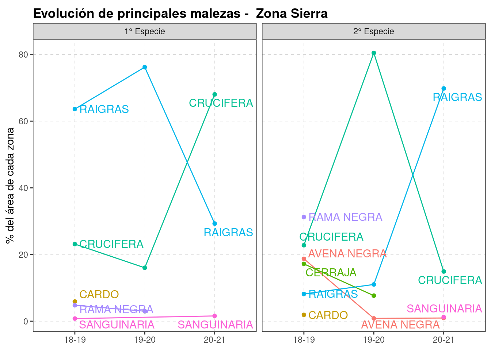

# Malezas


```r
knitr::opts_chunk$set(echo = TRUE, message=FALSE, warning=FALSE)
pacman::p_load(tidyverse, fuzzyjoin) 
load(here::here("data/data.Rdata"))
source(here::here("0 themes.R"))
```


```r
dat %>% 
  select(campana, Zona, cultivo_de_cosecha, superficie, starts_with("especie")) %>% 
  mutate(across(starts_with("especie"), 
                ~stringi::stri_trans_general(., "Latin-ASCII"))) %>% #sacar acentos
  mutate(across(starts_with("especie"), 
                ~str_to_upper(gsub(',', '\\.',.)))) %>%  # UPPER + sacar ","
  mutate(across(starts_with("especie"), 
                ~str_replace(., "SP.", ""))) %>%  # sacar SP.
  mutate(across(starts_with("especie"), 
                ~str_trim(.))) -> adv_herb   #sacar espacios antes-desp
```


```r
adv_herb %>%
  filter_at(vars(starts_with("especie")), any_vars(!is.na(.))) %>%
  pivot_longer(-(campana:superficie), names_to = "nivel", values_to = "maleza")%>% 
  filter(!maleza %in% c(NA, "OTRO", "OTRA", "VARIAS", "ROSETA"))%>%   
  count(maleza) 
```

```
## # A tibble: 14 x 2
##    maleza          n
##    <chr>       <int>
##  1 AVENA NEGRA    47
##  2 CAPIQUI         4
##  3 CARDOS          4
##  4 CRUCIFERAS    266
##  5 PAPA            3
##  6 PEREJILILLO     1
##  7 POA             1
##  8 RAIGRAS       224
##  9 RAIGRASS        1
## 10 RAMA NEGRA     61
## 11 SANGUINARIA    15
## 12 SONCHUS        53
## 13 TRIGO           2
## 14 VIOLA           4
```

```r
malezas_ref <- gsheet::gsheet2tbl("https://docs.google.com/spreadsheets/d/1cTzo36jHRULfBf8c83TDpauxiwHrxeKrGprUUxLRzm0/edit#gid=1182890772")

malezas_ref %>% print(n=Inf)
```

```
## # A tibble: 33 x 4
##    genero      sp         n_comun        n_grupo 
##    <chr>       <chr>      <chr>          <chr>   
##  1 ALTAMISA    <NA>       ALTAMISA       <NA>    
##  2 <NA>        <NA>       AVENA NEGRA    GRAMINEA
##  3 IPOMOEA     PURPUREA   BEJUCO         <NA>    
##  4 BORRERIA    DENSIFLORA BORRERIA       <NA>    
##  5 ECHINOCLOA  CRUSGALLI  CAPIN          <NA>    
##  6 CIRSIUM     VULGARE    CARDO          <NA>    
##  7 BROMUS      <NA>       CEBADILLA      GRAMINEA
##  8 CYPERUS     ROTUNDUS   CEBOLLIN       <NA>    
##  9 SONCHUS     OLERACEUS  CERRAJA        <NA>    
## 10 CHLORIS     <NA>       CHLORIS        GRAMINEA
## 11 COMMELINA   <NA>       COMMELINA      <NA>    
## 12 PAPPOPHORUM <NA>       CORTADERA      <NA>    
## 13 <NA>        <NA>       CRUCIFERA      <NA>    
## 14 DIGITARIA   <NA>       DIGITARIA      <NA>    
## 15 ELEUSINE    <NA>       ELEUSINE       <NA>    
## 16 EUPHORBIA   <NA>       EUPHORBIA      <NA>    
## 17 GNAPHALIUM  <NA>       GNAPHALIUM     <NA>    
## 18 GOMPHRENA   <NA>       GOMPHRENA      <NA>    
## 19 CYNODON     DACTYLON   GRAMON         GRAMINEA
## 20 LAMIUN      <NA>       LAMIUN         <NA>    
## 21 ZEA MAIZ    <NA>       MAIZ RR        <NA>    
## 22 <NA>        <NA>       MANI GUACHO    <NA>    
## 23 BASSIA      <NA>       MORENITA       <NA>    
## 24 PARIETARIA  DEBILIS    OCUCHA         <NA>    
## 25 <NA>        <NA>       RAIGRAS        GRAMINEA
## 26 CONYZA      <NA>       RAMA NEGRA     <NA>    
## 27 <NA>        <NA>       SANGUINARIA    <NA>    
## 28 SENECIO     PAMPEANUS  SENECIO        <NA>    
## 29 <NA>        <NA>       SONCHUS        <NA>    
## 30 SORGHUM     HALEPENSE  SORGO DE ALEPO GRAMINEA
## 31 TRICHLORIS  <NA>       TRICHLORIS     <NA>    
## 32 VIOLA       ARVENSIS   VIOLA          <NA>    
## 33 AMARANTHUS  QUITENSIS  YUYO COLORADO  <NA>
```

```r
# browseURL("https://docs.google.com/spreadsheets/d/1YL6vwgVu1nyMuZLRZw5uMav7cMt2mDXd7mI2S8Q6Q7c/edit#gid=950522321")

herb_long <- adv_herb %>% #count(especie_principal)
  filter_at(vars(starts_with("especie")), any_vars(!is.na(.))) %>%
  pivot_longer(-(campana:superficie), names_to = "nivel", values_to = "maleza")%>% 
  filter(!maleza %in% c(NA, "OTRO", "OTRA", "VARIAS", "ROSETA")) %>% 
   stringdist_left_join(malezas_ref %>% drop_na(genero), 
                        by = c(maleza = "genero"), max_dist = 1) %>%
   stringdist_left_join(malezas_ref %>% drop_na(n_comun), 
                        by = c(maleza = "n_comun"), max_dist = 1) %>%
  mutate(maleza = coalesce(n_comun.x,n_comun.y )) %>%
         select(campana:nivel, maleza)%>%
  group_by(campana, Zona, nivel, maleza)%>%
  summarise(var_sup = sum(superficie, na.rm = TRUE))%>%  
  group_by(campana, Zona, nivel) %>% 
  mutate(Zona= as.factor(Zona),
         porcent=var_sup/sum(var_sup)*100, 
         nivel = recode(nivel, especie_principal = "1° Especie", 
                        especie_secundaria = "2° Especie", 
                        especie_terciaria= "3° Especie")) %>% 
  drop_na(maleza)
herb_long
```

```
## # A tibble: 98 x 6
## # Groups:   campana, Zona, nivel [26]
##    campana Zona  nivel      maleza      var_sup porcent
##    <chr>   <fct> <chr>      <chr>         <dbl>   <dbl>
##  1 18-19   Costa 1° Especie AVENA NEGRA     419  11.9  
##  2 18-19   Costa 1° Especie CERRAJA         415  11.8  
##  3 18-19   Costa 1° Especie CRUCIFERA      1967  55.8  
##  4 18-19   Costa 1° Especie RAIGRAS         655  18.6  
##  5 18-19   Costa 1° Especie RAMA NEGRA       38   1.08 
##  6 18-19   Costa 1° Especie SANGUINARIA      30   0.851
##  7 18-19   Costa 2° Especie AVENA NEGRA     299   7.41 
##  8 18-19   Costa 2° Especie CERRAJA         661  16.4  
##  9 18-19   Costa 2° Especie CRUCIFERA      1353  33.5  
## 10 18-19   Costa 2° Especie RAIGRAS        1142  28.3  
## # … with 88 more rows
```

```r
# herb_long %>% write_sheet(ss=jmf, sheet = "malezas")
```


```r
plots_herb <- 
  herb_long %>%
  filter(!nivel == "3° Especie")%>%
  group_by(Zona) %>%
  nest() %>%
  mutate(plot = map2(data, Zona, 
                     ~ggplot(data = .x,  
         aes(x = factor(campana), 
             y = porcent, 
             col = maleza, 
             group = maleza))+
             geom_line()+
  geom_point()+
  labs(x = NULL, y = "% del área de cada zona",
        title = paste0("Evolución de principales malezas -  Zona ", .y))+
  guides(col="none")+
  facet_wrap(~nivel)+
  ggrepel::geom_text_repel(
    data = .x  %>% filter(Zona == .y, campana == "20-21"),
    aes(label = maleza), size =4, nudge_x = 0.2) +
   ggrepel::geom_text_repel(
    data = .x  %>% filter(Zona == .y, campana == "18-19"),
    aes(label = maleza), size =4, nudge_x = 0.2) +
   theme_bw2
))
plots_herb$plot
```

```
## [[1]]
```


```
## 
## [[2]]
```


```
## 
## [[3]]
```



```r
# file_names <- paste0("adversidades/", levels(herb_long$Zona), "_malezas.png")
# map2(file_names, plots_herb$plot, ggsave) 
```

